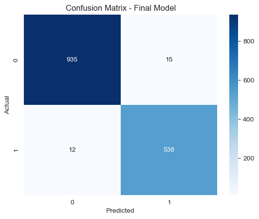
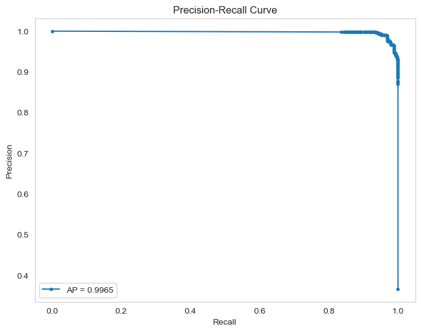

# 🏥 Patient Readmission Prediction using Random Forest

## 📌 Project Overview
Hospital readmissions within 30 days of discharge are a major challenge for healthcare providers — increasing costs, risking penalties, and potentially affecting the quality of care.  

This project addresses the question:  

**"Can we predict if a patient will be readmitted within 30 days, based on their demographics, medical background, and hospital visit history?"**  

By accurately predicting high-risk patients, hospitals can proactively intervene — improving outcomes, reducing costs, and enhancing patient care.

---

## 📊 Dataset
The dataset contains **10,000 patient records** with **50 variables** capturing demographics, medical history, hospitalization details, and readmission status.

### Key Features
- **ReAdmis** *(Target)* — Whether the patient was readmitted within 30 days (`yes` / `no`)
- **HighBlood** — High blood pressure (Yes/No)
- **Stroke** — History of stroke (Yes/No)
- **Overweight** — Overweight status (Yes/No)
- **Arthritis**, **Diabetes**, **Asthma**, etc. — Other chronic conditions
- **Initial_admin** — Type of initial hospital admission (Emergency, Elective, Observation)
- **Doc_visits** — Number of primary physician visits during hospitalization
- **Full_meals_eaten** — Number of full meals eaten during stay
- **VitD_levels** — Vitamin D level (ng/mL)
- **Services** — Primary hospital service received (Blood work, MRI, etc.)
- **Initial_days** — Length of initial hospital stay
- **TotalCharge** — Daily average hospital charge

The target variable `ReAdmis` was label-encoded (`no` → `0`, `yes` → `1`).

---

## ⚙️ Data Preprocessing
1. **Initial Checks** — Viewed table info, checked for duplicates.
2. **Column Dropping** — Removed unnecessary ID, location, and survey-related columns.
3. **Encoding** — 
   - Target (`ReAdmis`): LabelEncoded.
   - Categorical features: One-Hot Encoding.
4. **Data Splitting** — Train/Test/Validation split using stratification.
5. **Saved** — Preprocessed datasets for reproducibility.

---

## 🤖 Model Selection
I chose **Random Forest Classifier** because:
- It handles **both categorical & numerical** variables well.
- Works effectively with datasets containing **many features**.
- Provides **robustness** against overfitting.

---

## 📈 Model Performance

### **Initial Model (No Tuning)**
| Metric       | Score   |
|--------------|---------|
| Accuracy     | 0.9787  |
| Precision    | 0.9779  |
| Recall       | 0.9637  |
| F1 Score     | 0.9707  |
| AUC-ROC      | 0.9974  |

#### Confusion Matrix — Initial Model

---

### **Optimized Model (5-Fold Cross-Validation)**
**Best Parameters**:  
`{'n_estimators': 50, 'min_samples_split': 10, 'min_samples_leaf': 2, 'max_features': None, 'max_depth': 15, 'bootstrap': True}`  

**Test Set Metrics:**
| Metric       | Score   |
|--------------|---------|
| Accuracy     | 0.9820  |
| Precision    | 0.9729  |
| Recall       | 0.9782  |
| F1 Score     | 0.9755  |
| AUC-ROC      | 0.9986  |

#### Confusion Matrix — Optimized Model

#### Precision–Recall Curve

---

## 🔍 Key Insights
- **Recall increased** from 0.9637 → 0.9782, making the model better at identifying patients who will be readmitted.
- **AUC-ROC improved** slightly, showing stronger class separation.
- **Slight drop in precision** was acceptable given the gain in recall — critical in healthcare, where missing at-risk patients is costlier than occasional false alarms.

---

## ⚠️ Limitation
- Missing **primary diagnosis** data limits the model’s ability to directly account for high-risk medical conditions.

---

## 📌 Recommendation
Integrate the optimized model into a **patient monitoring & discharge planning system**.  
Potential actions:
- Tailored discharge protocols for high-risk patients.
- Proactive follow-up scheduling.
- Patient-specific intervention plans.

---

## 🛠️ Tech Stack
- **Language**: Python
- **Libraries**: Pandas, NumPy, Scikit-learn
- **Model**: Random Forest Classifier

---

## 📜 License
This project is released under the MIT License.
